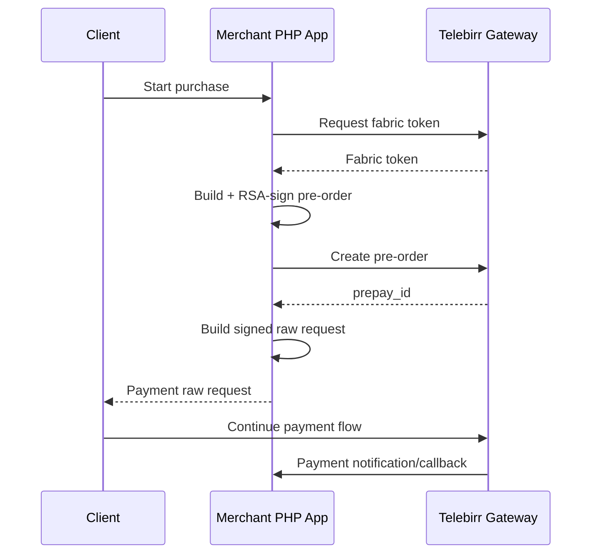

# Telebirr Payment Gateway Integration — PHP Reference

A PHP reference implementation for integrating a merchant application with the Telebirr payment flow: obtaining a fabric token, creating a signed pre-order request, generating the client raw request and receiving payment notifications.

> **Security note:** the current version expects merchant credentials and the RSA private key to be supplied at runtime. Do not place real secrets or private keys in this repository.

## What this project demonstrates

- third-party payment gateway integration
- token acquisition
- merchant pre-order creation
- SHA-256/RSA request signing
- secure runtime configuration
- signed payment request construction
- callback/notification endpoint integration
- browser/client handoff for payment initiation
- cURL-based HTTPS API communication

## Payment flow



## Main components

```text
Api/
├── config/
│   └── env.php                 Runtime environment mapping
├── service/
│   ├── applyFabricTokenService.php
│   └── createOrderService.php
├── utils/
│   └── tool.php                Canonicalization, nonce + RSA signing
└── index.php

Web/
├── js/startPay.js
├── login.html
└── product_list.html
```

## Runtime configuration

Set configuration through environment variables on the web server, container or process manager:

```dotenv
TELEBIRR_BASE_URL=
TELEBIRR_FABRIC_APP_ID=
TELEBIRR_APP_SECRET=
TELEBIRR_MERCHANT_APP_ID=
TELEBIRR_MERCHANT_CODE=
TELEBIRR_PRIVATE_KEY_PATH=/run/secrets/telebirr_private_key.pem
TELEBIRR_NOTIFY_URL=https://merchant.example.com/api/payment.php

TELEBIRR_BUSINESS_TYPE=BuyGoods
TELEBIRR_TRADE_TYPE=InApp
TELEBIRR_CURRENCY=ETB
TELEBIRR_TIMEOUT_EXPRESS=120m
TELEBIRR_PAYEE_IDENTIFIER=
TELEBIRR_PAYEE_IDENTIFIER_TYPE=
TELEBIRR_PAYEE_TYPE=
```

The private key should live outside the repository and be readable only by the application process.

## Install dependencies

```bash
cd Api
composer install
```

The integration uses PHP 7.4+/8.x, OpenSSL and phpseclib.

## Security improvements in the current public version

The repository has been hardened so that the current branch:

- no longer contains a merchant private key file
- reads merchant credentials from runtime environment variables
- reads the RSA private key from an external path
- uses cryptographically secure random nonces
- enables TLS peer and hostname verification for gateway requests
- checks HTTP/cURL failures instead of silently returning them

See [`SECURITY.md`](SECURITY.md) before using this code as an integration reference.

## Production guidance

Before production use:

1. Rotate all historical/development credentials that may ever have been committed or shared.
2. Use official/current Telebirr merchant documentation for endpoint and field requirements.
3. Keep private keys in a secret manager or protected filesystem path.
4. Validate callback authenticity and make payment notification handling idempotent.
5. Persist merchant order IDs and payment states in a database rather than relying on timestamps alone.
6. Add structured logging without logging secrets or full sensitive payloads.
7. Add automated integration tests against the supported sandbox environment.

## Portfolio context

This repository is useful as an example of the lower-level work involved in payment integrations: request signing, token exchange, external API communication, callback design and secret management.

For a more modern Laravel webhook/integration architecture, see [RelayHub](https://github.com/DagemawiDeveloper/laravel-api-integration-demo).

## Author

**Dagemawi Alemayehu**  
PHP · Laravel · API Integrations · Payments · SaaS
